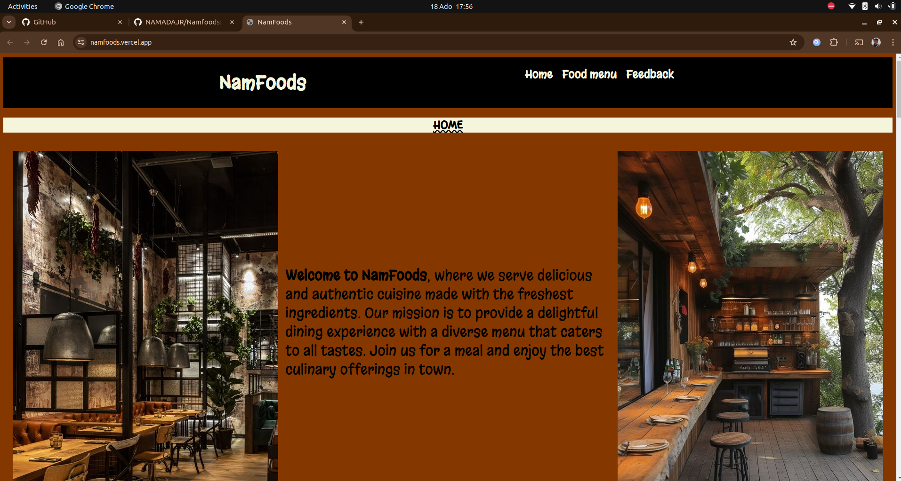
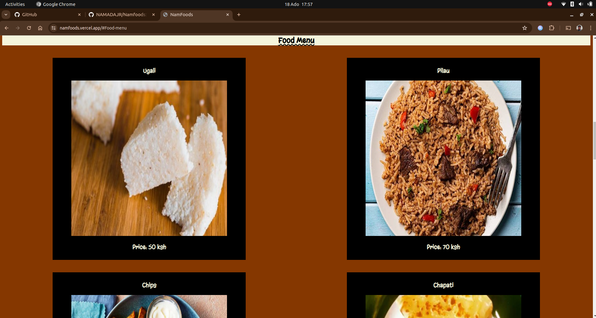
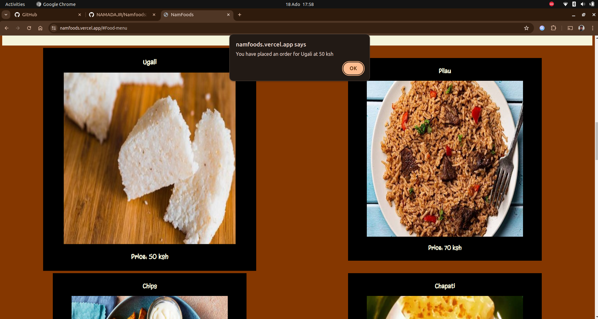
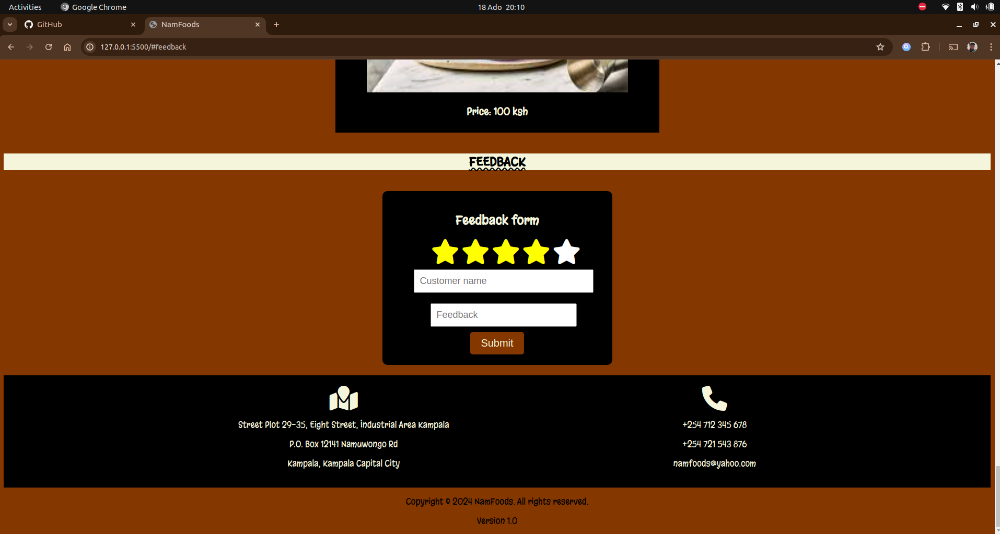
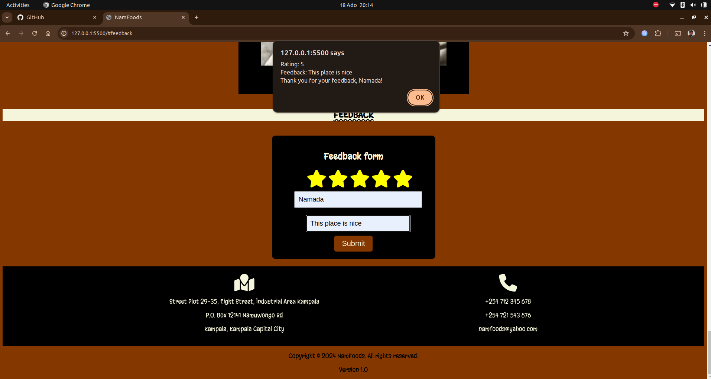
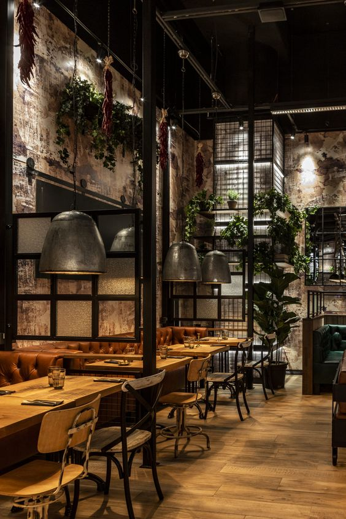
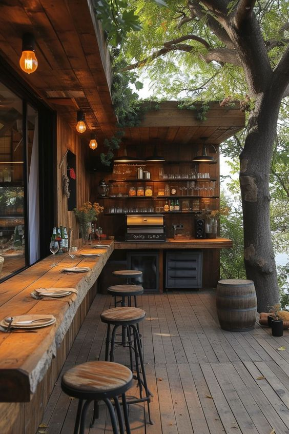
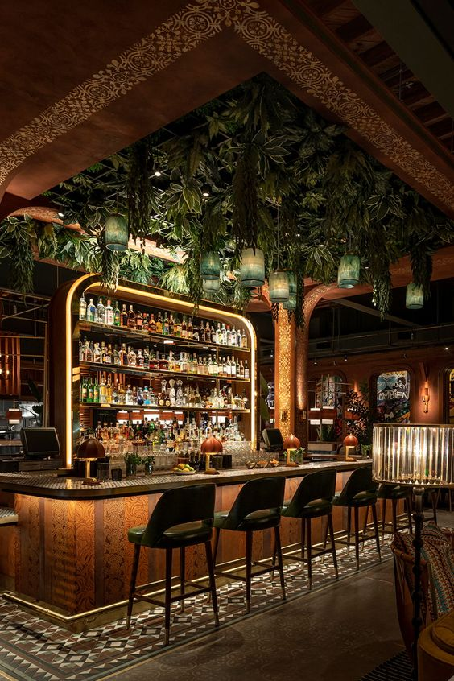

# Being updated to Version 1.1

# Namfoods Restaraunt

## By Namada Junior

## Project Description

NamFoods is a restaurant website that showcases its menu items and provides information about the restaurant's ambiance and services. The website is designed to provide a delightful dining experience with a diverse menu that caters to all tastes.

It features a wide variety of dishes, including signature dishes, seasonal specials, and a selection of fine wines, craft beers, and artisanal cocktails. NamFoods offers both indoor and outdoor seating areas, perfect for any occasion.

The website also includes a feedback section where customers can leave their feedback and ratings.

Here is the link to the website : [NamFoods](https://namfoods.vercel.app/)

## Feature of Namfoods
This is how the website looks upon being loaded on to the browser.


This is how the food menu section of the website looks like


As the user looks through the menu, when they hovers over an item it slightly pops up, when the item is clicked the user will recieve an alert that will inform them of the order placed.


This is how the feedback section of the page looks like.


If the user fills the feedback form, upon submittingthe forn, an alert containing the infortion entered will be displayed.



## Properties of the website

### HTML

This is the structure of the HTML file which is the foundation of the page.

```html
<!DOCTYPE html>
<html lang="en">
  <head>
    <meta charset="UTF-8" />
    <meta name="viewport" content="width=device-width, initial-scale=1.0" />
    <title>NamFoods</title>
    <link rel="stylesheet" href="css/style.css" />
    <script src="./script.js" defer></script>
    <link
      rel="stylesheet"
      href="https://cdnjs.cloudflare.com/ajax/libs/font-awesome/6.6.0/css/all.min.css"
      integrity="sha512-Kc323vGBEqzTmouAECnVceyQqyqdsSiqLQISBL29aUW4U/M7pSPA/gEUZQqv1cwx4OnYxTxve5UMg5GT6L4JJg=="
      crossorigin="anonymous"
      referrerpolicy="no-referrer"
    />
  </head>
  <body>
    <div id="header">
      <h1>NamFoods</h1>
      <nav>
        <h2>
          <a href="#Home">Home</a>
          <a href="#Food-menu">Food menu</a>
          <a href="#feedback">Feedback</a>
        </h2>
      </nav>
    </div>

    <section id="Home">
      <h2 class="titles">HOME</h2>

      <div class="container">
        <div class="image">
          
        </div>

        <div class="text">
          <p>
            <strong>Welcome to NamFoods</strong>, where we serve delicious and
            authentic cuisine made with the freshest ingredients. Our mission is
            to provide a delightful dining experience with a diverse menu that
            caters to all tastes. Join us for a meal and enjoy the best culinary
            offerings in town.
          </p>
        </div>

        <div class="image">
          
        </div>
      </div>

      <div class="container">
        <div class="text">
          <p>
            At NamFoods, we take pride in offering a wide variety of dishes to
            satisfy every palate. From our signature dishes to seasonal
            specials, each meal is prepared with utmost care and precision. Our
            chefs use locally sourced ingredients to ensure the highest quality
            and freshness in every bite. Enjoy our cozy ambiance and let our
            friendly staff make your dining experience unforgettable.
          </p>
        </div>

        <div class="image">
          
        </div>
        <div class="text">
          <p>
            We also offer a selection of fine wines, craft beers, and artisanal
            cocktails to complement your meal. Our restaurant features both
            indoor and outdoor seating areas, perfect for any occasion. Whether
            you're here to celebrate a special event or simply enjoy a night
            out, NamFoods provides a warm and welcoming atmosphere that you'll
            love coming back to.
          </p>
        </div>
      </div>
    </section>

    <section id="Food-menu">
      <div>
        <h2 class="titles">Food Menu</h2>

        <div id="menu-wrapper">
          <!-- Menu -->
        </div>
      </div>
    </section>

    <section id="feedback">
      <h2 class="titles">FEEDBACK</h2>
      <div class="container">
        <div id="form">
          <form>
            <h2>Feedback form</h2>
            <div>
              <div class="rating" style="width: 20rem">
                <input id="rating-5" type="radio" name="rating" value="5" />
                <label for="rating-5"><i class="fas fa-3x fa-star"></i></label>
                <input
                  id="rating-4"
                  type="radio"
                  name="rating"
                  value="4"
                  checked
                />
                <label for="rating-4"><i class="fas fa-3x fa-star"></i></label>
                <input id="rating-3" type="radio" name="rating" value="3" />
                <label for="rating-3"><i class="fas fa-3x fa-star"></i></label>
                <input id="rating-2" type="radio" name="rating" value="2" />
                <label for="rating-2"><i class="fas fa-3x fa-star"></i></label>
                <input id="rating-1" type="radio" name="rating" value="1" />
                <label for="rating-1"><i class="fas fa-3x fa-star"></i></label>
              </div>

              <input
                id="customer-name"
                type="text"
                placeholder="Customer name"
                required
              />
            </div>
            <div>
              <input
                id="feedback-text"
                type="text"
                placeholder="Feedback"
                required
              />
            </div>
            <div>
              <button type="submit" id="btn">Submit</button>
            </div>
          </form>
        </div>
      </div>

      <div id="footer">
        <div>
          <i class="fa-solid fa-map-location fa-3x"></i>
          <p>Street Plot 29-35, Eight Street, Industrial Area Kampala</p>
          <p>P.O. Box 12141 Namuwongo Rd</p>
          <p>Kampala, Kampala Capital City</p>
        </div>
        <div>
          <i class="fa-solid fa-phone fa-3x"></i>
          <p>+254 712 345 678</p>
          <p>+254 721 543 876</p>
          <p>namfoods@yahoo.com</p>
        </div>
      </div>

    </section>

<div id="copy-version">
  <p>Copyright &copy; 2024 NamFoods. All rights reserved.</p>
  <p>Version 1.0</p>
</div>

  </body>
</html>

```

### CSS

This is the styling that was used to make the website more appealing to the user.

```css
@import url("https://fonts.googleapis.com/css2?family=Bilbo+Swash+Caps&family=Ga+Maamli&family=Jacquarda+Bastarda+9+Charted&family=Margarine&family=Playball&family=Playwrite+IS&display=swap");

html {
  scroll-behavior: smooth;
}

body {
  background-color: rgb(133, 55, 0);
  font-family: "Margarine", sans-serif;
  font-weight: 400;
  font-style: normal;
}

#header {
  color: beige;
  font-family: "Margarine", sans-serif;
  background-color: black;
  display: flex;
  justify-content: space-evenly;

  h1 {
    font-size: 40px;
  }
}

.titles {
  color: black;
  text-decoration: underline wavy;
  text-align: center;
  background-color: beige;
}

nav {
  display: flex;
  justify-content: center;

  a {
    color: beige;
    text-decoration: none;
    padding: 7px;
  }
}

.container {
  display: flex;
  justify-content: space-around;
  padding: 20px;
}

.text {
  font-family: "Margarine", sans-serif;
  color: black;
  font-size: 30px;
  padding: 15px;
  margin-top: 200px;
}

.image {
  size: 350px;
}

#menu-wrapper {
  display: flex;
  justify-content: space-around;
  flex-wrap: wrap;
}

.photo {
  width: 600px;
  display: flex;
  flex-direction: column;
  justify-content: center;
  align-items: center;
  margin: 20px;
  padding: 10px;
  background-color: black;
  color: beige;
  transition: all 0.7s;
}

.photo:hover {
  transform: scale(1.1);
}

.photo img {
  width: 500px;
  height: 500px;
}

#form {
  display: flex;
  justify-content: center;

  form {
    display: flex;
    flex-direction: column;
    justify-content: center;
    align-items: center;
    width: 400px;
    padding: 20px;
    background-color: black;
    border-radius: 10px;
  }

  input {
    width: 100%;
    padding: 10px;
    margin: 10px 0;
    font-size: 18px;
  }

  h2{
    color: beige;
  }
}

#btn {
  padding: 10px 20px;
  font-size: 20px;
  background-color: rgb(133, 55, 0);
  color: beige;
  border: none;
  border-radius: 5px;
  cursor: pointer;
  transition: all 0.7s;
}

#btn:hover {
  transform: scale(1.1);
}

.rating {
  direction: rtl;
  unicode-bidi: bidi-override;
  color: white;
}
.rating input {
  display: none;
}
.rating label:hover,
.rating label:hover ~ label,
.rating input:checked + label,
.rating input:checked + label ~ label {
  color: yellow;
}

#footer {
  background-color: black;
  color: beige;
  text-align: center;
  padding: 20px;
  display: flex;
  justify-content: space-evenly;
}

p {
  text-align: center;
}

```

### Javascript

```js
document.addEventListener("DOMContentLoaded", () => {
  const apiUrl = "https://namfoods-mock-remote-backend.vercel.app/menu";

  fetch(apiUrl)
    .then((res) => res.json())
    .then((photos) => photos.forEach((photo) => createPhoto(photo)));

  function createPhoto(photo) {
    const { id, title, imageUrl, price } = photo;

    let wrapper = document.getElementById("menu-wrapper");

    const divCard = document.createElement("div");
    divCard.className = "photo";
    divCard.id = `photo-${id}`;

    const html = `
    <div>
      <h3>${title}</h3>
    </div>
    <div>
      
    </div>
    <div>
      <h3>Price: ${price}</h3>
    </div>
  `;

    divCard.innerHTML = html;
    wrapper.appendChild(divCard);

    divCard.addEventListener("click", () => {
      bought(id, price, title);
    });
  }

  function bought(id, price, title) {
    alert(`You have placed an order for ${title} at ${price}`);
  }

  const form = document.querySelector("#form form");
  form.addEventListener("submit", (event) => {
    event.preventDefault();

    const customerName = document.querySelector("#customer-name").value;
    const feedbackText = document.querySelector("#feedback-text").value;
    const rating = document.querySelector('input[name="rating"]:checked').value;

    alert(
      `Rating: ${rating}\nFeedback: ${feedbackText}\nThank you for your feedback, ${customerName}!`
    );

    form.reset();
  });
});
```

## System Requirements

- Node 18+
- A browser capable of running JavaScript (Chrome, Firefox, Safari, or Edge)
- Operating System (Windows 10+, MacOS, Linux, etc.)
- A text editor capable of running JavaScript (Visual Studio Code, Vim, Nano, Emacs, Atom, Sublime Text, etc.)
- RAM >= 4GB
- Disk space >= 1GB

## Technology used

Used Visual Studio Code editor to write the HTML, CSS and Javascript used to create the website.

HTML - HTML was used to create the structure and foundation of the landing page.

CSS - used css to style the website to look appealing to the user.

Javascript - Used Javascript to create functions and conditions that manipulate items on the webpage.

## Development

Want to contribute? Excellent, To enhance or contribute on the existing project, follow these steps:

- Fork the repo
- Create a new branch (git checkout -b enhance-feature)
- Make the appropriate changes in the files
- Add changes to reflect the changes made
- Commit your changes (git commit -m 'enhanced feature')
- Push to the branch (git push origin enhance-feature)
- Create a Pull Request

## License

MIT License

Copyright (c) [2024] [Namada Junior]

Permission is hereby granted, free of charge, to any person obtaining a copy
of this software and associated documentation files (the "Software"), to deal
in the Software without restriction, including without limitation the rights
to use, copy, modify, merge, publish, distribute, sublicense, and/or sell
copies of the Software, and to permit persons to whom the Software is
furnished to do so, subject to the following conditions:

The above copyright notice and this permission notice shall be included in all
copies or substantial portions of the Software.

THE SOFTWARE IS PROVIDED "AS IS", WITHOUT WARRANTY OF ANY KIND, EXPRESS OR
IMPLIED, INCLUDING BUT NOT LIMITED TO THE WARRANTIES OF MERCHANTABILITY,
FITNESS FOR A PARTICULAR PURPOSE AND NONINFRINGEMENT. IN NO EVENT SHALL THE
AUTHORS OR COPYRIGHT HOLDERS BE LIABLE FOR ANY CLAIM, DAMAGES OR OTHER
LIABILITY, WHETHER IN AN ACTION OF CONTRACT, TORT OR OTHERWISE, ARISING FROM,
OUT OF OR IN CONNECTION WITH THE SOFTWARE OR THE USE OR OTHER DEALINGS IN THE
SOFTWARE.
